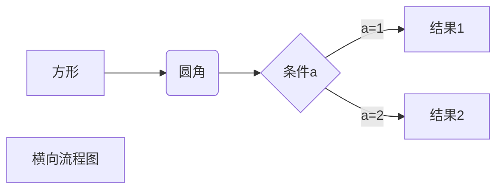
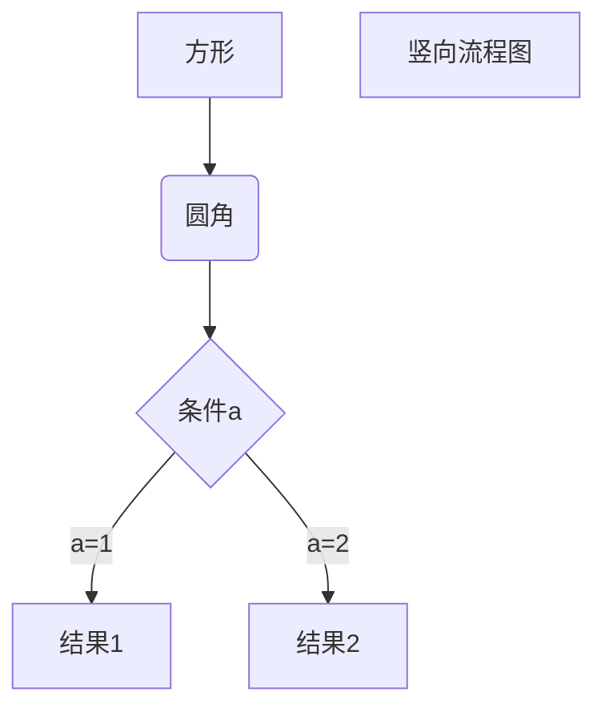
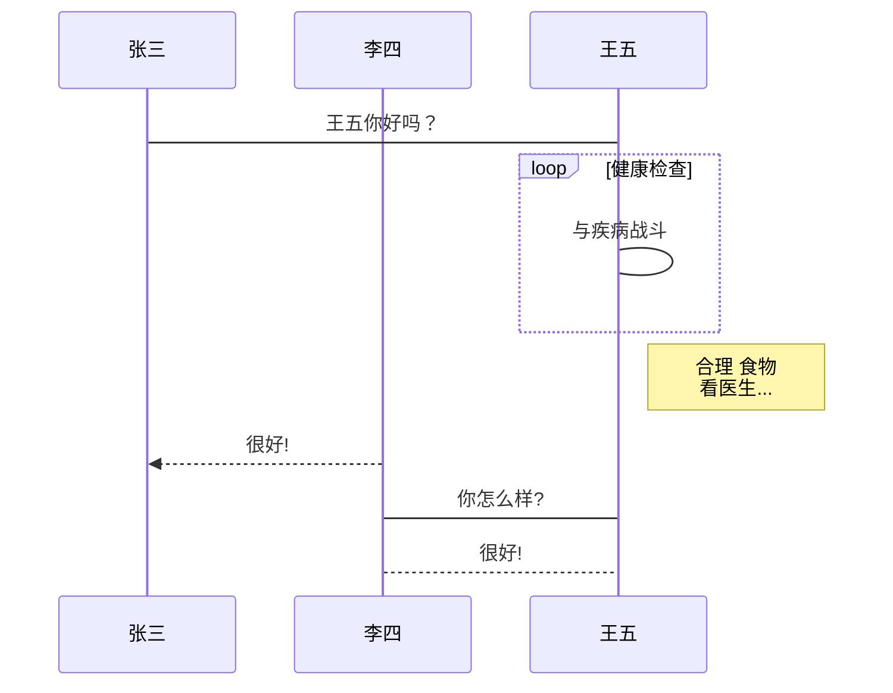
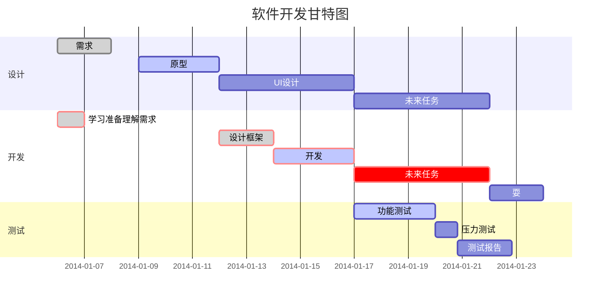

# Markdown
[TOC]
## 一、UML图
### 1.序列图
基于[js-sequence-diagrams](https://bramp.github.io/js-sequence-diagrams/) 实现了序列图，使用下列的格式声明一个序列图： 
```sequence
Title: Here is a title
A->B: Normal line
B-->C: Dashed line
C->>D: Open arrow
D-->>A: Dashed open arrow
```
```sequence
# Example of a comment.
Note left of A: Note to the\n left of A
Note right of A: Note to the\n right of A
Note over A: Note over A
Note over A,B: Note over both A and B
```

```sequence
participant C
participant B
participant A
Note right of A: By listing the participants\n you can change their order
```

1、横向流程图源码格式：



2、竖向流程图源码格式：



3、标准流程图源码格式：

```flow
st=>start: 开始框
op=>operation: 处理框
cond=>condition: 判断框(是或否?)
sub1=>subroutine: 子流程
io=>inputoutput: 输入输出框
e=>end: 结束框
st->op->cond
cond(yes)->io->e
cond(no)->sub1(right)->op
```

4、标准流程图源码格式（横向）：

```flow
st=>start: 开始框
op=>operation: 处理框
cond=>condition: 判断框(是或否?)
sub1=>subroutine: 子流程
io=>inputoutput: 输入输出框
e=>end: 结束框
st(right)->op(right)->cond
cond(yes)->io(bottom)->e
cond(no)->sub1(right)->op
```

5、UML时序图源码样例：

```sequence
对象A->对象B: 对象B你好吗?（请求）
Note right of 对象B: 对象B的描述
Note left of 对象A: 对象A的描述(提示)
对象B-->对象A: 我很好(响应)
对象A->对象B: 你真的好吗？
```

6、UML时序图源码复杂样例：

```sequence
Title: 标题：复杂使用
对象A->对象B: 对象B你好吗?（请求）
Note right of 对象B: 对象B的描述
Note left of 对象A: 对象A的描述(提示)
对象B-->对象A: 我很好(响应)
对象B->小三: 你好吗
小三-->>对象A: 对象B找我了
对象A->对象B: 你真的好吗？
Note over 小三,对象B: 我们是朋友
participant C
Note right of C: 没人陪我玩
```

7、UML标准时序图样例：



8、甘特图样例：



## 二、
[](https://github.com/adrai/flowchart.js)

## 三、公式
> 补充：对于有 Latex 公式的文章，由于 Github 的 markdown 解析是通过 SunDown 库实现的。这个库的宗旨就是 "Standards compliant, fast, **secure**markdown processing library in C"。快就够用就行。并没打算加 latex 功能，并且 Markdown 原生就是不支持 LaTeX 的，GitHub Flavored Markdown 同样不支持。Markdown 的初衷就是成为一种与HTML兼容的“易读易写”的轻量级的网络标记语言，并不要求支持 LaTeX。我通过 codecogs 的云服务api 进行解析，所以文档中存在 Latex 书写的地方都以图片的形式存在。当然我建议你为了显示方便，也可以采用 Chrome 插件：[MathJax Plugin for Github](https://chrome.google.com/webstore/detail/mathjax-plugin-for-github/ioemnmodlmafdkllaclgeombjnmnbima)，在你自己的浏览器解析了 tex 公式，安装此插件需要科学上网，为了方便起见，我还是选择通过第三方 api 解析。
>
> 所有的公式格式均为 ``
>
> 例如：
>
> 我们可以写成如下形式：
>
> ```markdown
> 
> ```

```$$
\mathbf{V}_1 \times \mathbf{V}_2 =  \begin{vmatrix} 
\mathbf{i} & \mathbf{j} & \mathbf{k} \\
\frac{\partial X}{\partial u} &  \frac{\partial Y}{\partial u} & 0 \\
\frac{\partial X}{\partial v} &  \frac{\partial Y}{\partial v} & 0 \\
\end{vmatrix}
$$```


## 四、脚注
创建脚注格式类似这样 [^RUNOOB]。

[^RUNOOB]: 杨秉学 -- YBX is the most handsome man in NCEPU！！！
