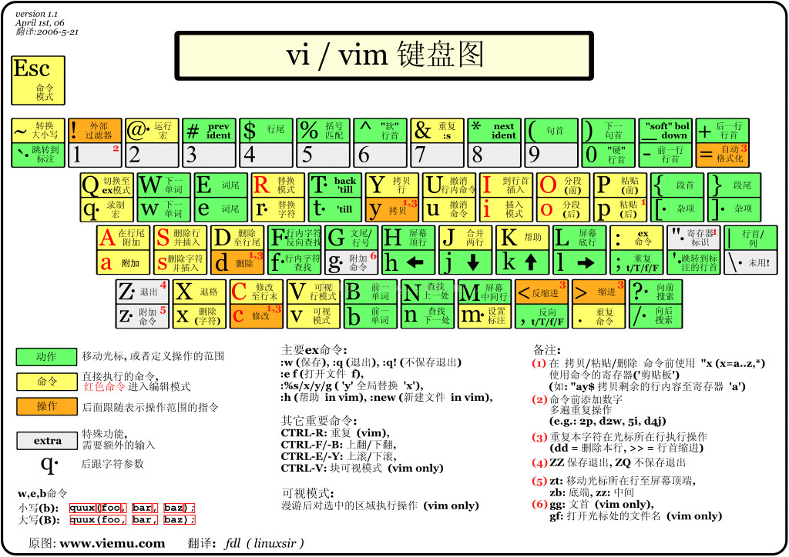
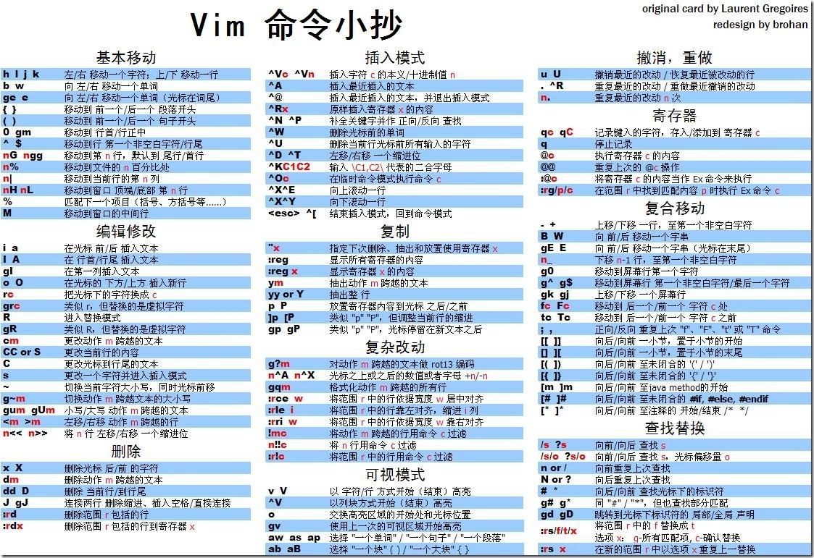

[TOC]
# 计算机基本工具使用
## 一、Vim

#### 书籍
[A Byte of Vim](vim/A_Byte_of_Vim.pdf)

[Hacking Vim 7.2](vim/Hacking_Vim_7.2.pdf)

[vim用户手册中文版72](vim/vim用户手册中文版72.pdf)

[vim用户手册中文版73](vim/vim用户手册中文版73.pdf)

[学习VI和VIM编辑器第7版](vim/学习VI和VIM编辑器第7版.pdf)

#### 视频教程
[Linux文本编辑器VIM视频教程](https://www.bilibili.com/video/av80488178)

## 二、Emacs
#### 书籍
[学习GNU Emacs](Emacs/学习GNU.Emacs.pdf)

## 三、git
### 尚硅谷git_github
#### 视频教程
[尚硅谷git_github](https://www.bilibili.com/video/av81226714)
#### 课件
[课件pdf](git/尚硅谷git_github/课件/Git&GitHub.pdf)
[课件ppt](git/尚硅谷git_github/课件/Github2015.12V1.6.pptx)

### 播布客_小布老师git入门视频
#### 视频教程
[播布客_小布老师git入门视频](https://www.bilibili.com/video/av79472360)

### Git权威指南视频教程
#### 视频教程
[Git权威指南视频教程](https://www.bilibili.com/video/av80501819)

## 四、Latex
#### 书籍
[140分钟学会LaTex](Latex/140分钟学会LaTex.pdf)
#### 课件
[Latex Talk2018](Latex/Latex_Talk2018.pdf)