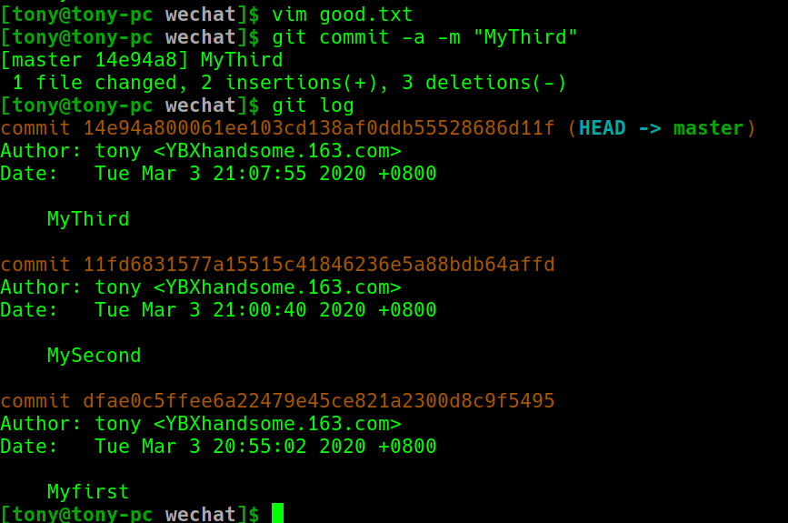
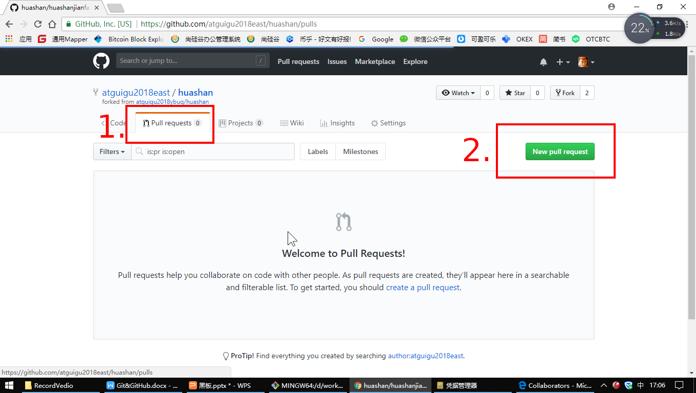

# 尚硅谷git与github
### 视频教程
[尚硅谷git_github](https://www.bilibili.com/video/av81226714) &emsp; [课件](课件/Github2015.12V1.6.pptx) &emsp; [推送](https://mp.weixin.qq.com/s?__biz=MzU1OTM3ODQ0MA==&mid=2247485228&idx=6&sn=405b13120a5062b71e6bed550e2d8aed&chksm=fc197e4bcb6ef75d69a48e82c03493fd6d3b11cafb841a1d74c99540608da282bef47a7c494e&mpshare=1&scene=1&srcid=03045R8uAOfABZAZSqcyjSGr&sharer_sharetime=1583287042360&sharer_shareid=4df20d63d6b5f1c166ee0c94563cc50d&exportkey=AWTzfDloJbtabjtfUyc0ELo%3D&pass_ticket=aCyG8zhKyItj2ve21%2F3Rc0u9TAhvwylF%2F5YQThbg4cs%3D#rd)


## 一、Git
### 1.设置签名
#### 1)形式:
- 用户名：tony
- Email 地址：YBXhandsome@163.com
#### 2)作用：区分不同开发人员的身份
辨析：这里设置的签名和登录远程库(代码托管中心)的账号、密码没有任何关系。
#### 3)命令
##### (1)项目级别/仓库级别：仅在当前本地库范围内有效
> ```git config user.name tony``` <br>
> ```git config user.email YBXhandsome@163.com```

信息保存位置：./.git/config 文件


##### (2)全局级别
> ```git config --global user.name tony``` <br>
> ```git config --global user.email YBXhandsome@163.com```


### 2.查看状态


### 3.添加缓存区和移除缓存区


### 4.commit


修改之后```commit```


### 5.版本的前进和后退
#### 1)log与reflog



#### 2)reset 命令的三个参数对比


### 6.永久删除文件找回


## 二、分支
新建、查看分支


合并分支


冲突——两个分支同一文件、同一位置。


## 三、github
### 1.在本地创建远程库地址别名
给```https://github.com/IammyselfYBX/NCEPU_CS_course.git```取别名成为```origin```

```
$> git remote add origin https://github.com/IammyselfYBX/NCEPU_CS_course.git
```


因为远程存在文件，所以需要pull之后才能push

### 2.邀请成员


### 3.pull request
---
#### fork仓库的人
fork以后提出才能向原仓库作者```pull request```



点击```create pull request```


填写需要告诉原仓库作者的话。


```pull request```成功。


---
#### 原仓库作者
发现```pull request```不为0


可以查看提交哪里修改哪里了


检查无误以后```merge pull request```


还要写```commit```内容。


