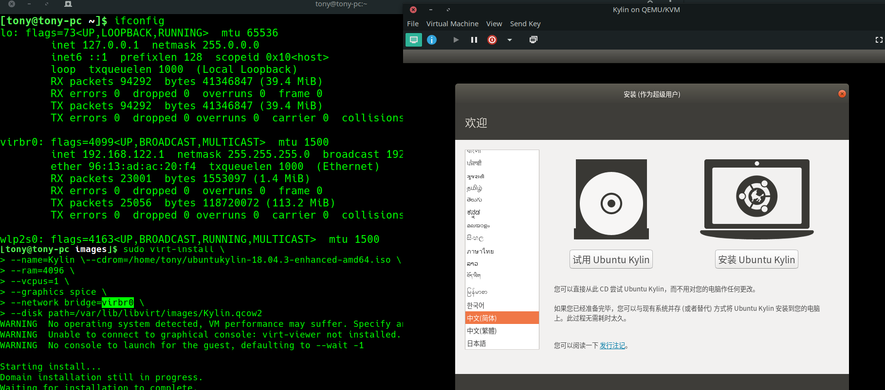
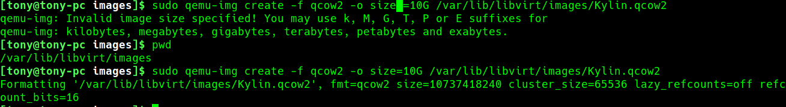

# KVM使用指南
### 安装Kylin
```
[tony@tony-pc images]$ sudo qemu-img create -f qcow2 -o size =10G /var/lib/libvirt/images/Kylin.qcow2

[tony@tony-pc images]$ sudo virt-install \
> --name=Kylin \--cdrom=/home/tony/ubuntukylin-18.04.3-enhanced-amd64.iso \
> --ram=4096 \
> --vcpus=1 \
> --graphics spice \
> --network bridge=virbr0 \
> --disk path=/var/lib/libvirt/images/Kylin.qcow2 
```


注意事项：

